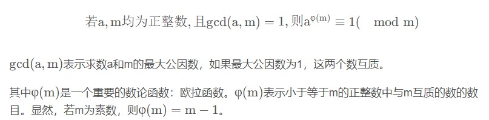
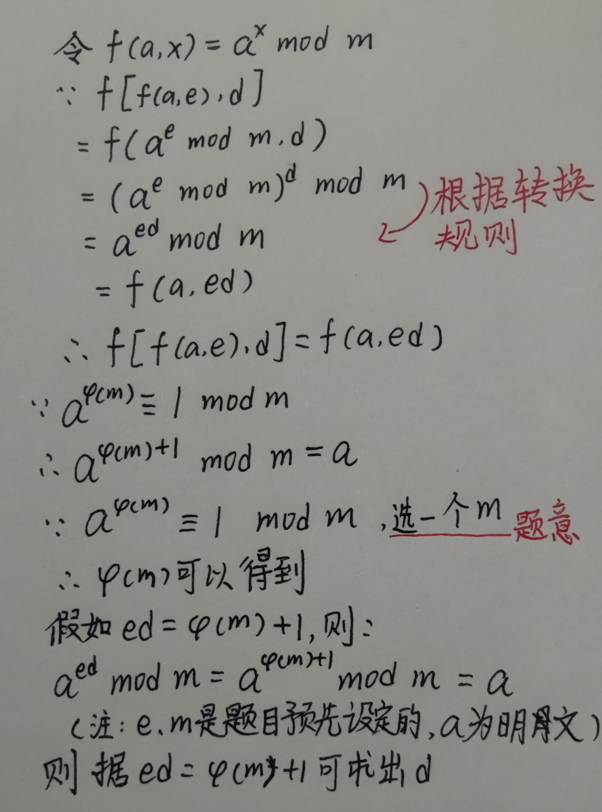
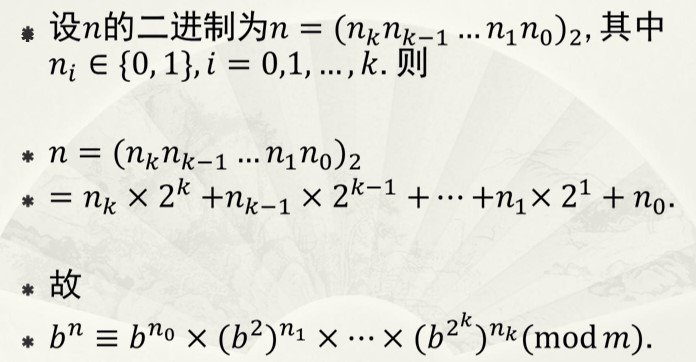
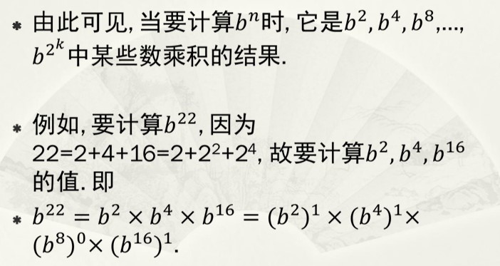
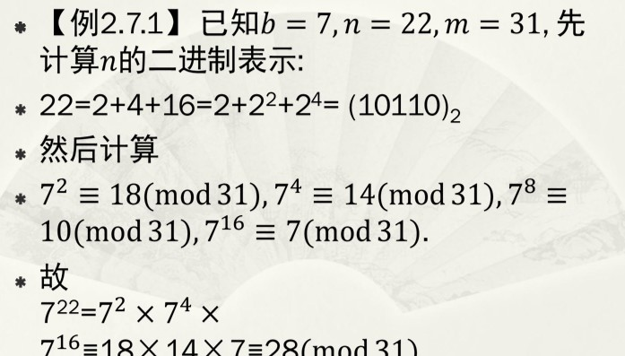

# RSA算法

设加密函数为F1(m,e)，m为明文，e为加密密钥，解密函数为F2(x,d)，x为密文，d为解密密钥。那么我们需要找到函数F1和F2，使得：m=F2(F1(m,e),d)成立，经过函数F1和F2两次变换之后，我们需要能够将明文还原回来。

为了解决上面的问题，我们需要对两个数学知识有一定的了解，第一个是欧拉定理，第二个则是模算术。

## 欧拉定理



## 模算术

如果A和B满足A mod  n = B mod  n ，我们称之为A与B有同余关系，同余关系常常又表示成：A ≡ B ( mod n ) 。同余关系是一种等价关系。
模的含义可用换算为普通乘式：A mod B = C  →   A = kB + C

基本的模加法和模乘法、模幂运算规则如下：




经过上面的简单思考，我们来解决一些随之而来的问题。

- a^(φ(m)+1) mod m = a，实际上弱化了欧拉定理，要求底数a < m a<ma<m。不过这并不是什么大问题，底数a代表的明文如果实在太长，我们把它分割一下，让它小于m就行了。
- 在实现上仍有诸多疑问：一个数的幂的结果增长得特别快，计算a^(ed)是否很容易超出编程语言中整型变量的范围呢？如何根据n确定φ ( n ) ?

## 模重复平方法

用于解决a^(ed)超出编程语言中整型变量的范围的问题



```go
// 模重复平方法
func m(b int, n int, m int) int {
	s := 1//用于累加累乘得到结果
	x := strconv.FormatInt(int64(n), 2)//将数n转换为二进制
    //从低位开始遍历（右边）
	for i := len(x) - 1; i >= 0; i-- {
		if int(x[i])-48 == 1 {//减48：因为ASCII码
			s = (s * b) % m//累乘取模
		}
		b = (b * b) % m//将b指数+1
	}
	return s
}
```





## 如何产生m与如何计算φ ( m )

因为我们选定了f ( m , e ) = m^e  mod n来进行加密运算，那么公钥e和模n都需要公开，其他人才可以进行加密。m被公开则触及一个核心的问题：既然m被公开，φ ( m ) 不是很容易被计算出来吗？又有ed = φ (m) + 1，那么密钥d不是很容易确定吗？这样还存在保密性吗？

首先，对于一个合数而言，欧拉函数φ (m)的值其实不那么容易被计算出来，因为没有有效的算法来计算甚至估算这个函数的值，我们只能暴力地从1到m − 1 m-1，一个个去尝试它是否与m互质。问题随之而来，如果公开的模n复杂到别人无法暴力破解φ (m)，那么我们又凭什么能够快速算出φ (m)呢？算法又需要这个值来生成公钥和私钥。

下面的这个定理完美解决了上述问题：若p和q都是素数，n=pq，那么φ(n)=φ(p)φ(q)

以上定理不作证明，我们使用这个定理，轻易就能得出φ (n) = (p−1) (q−1)，也就是说，只要找到n的两个素数因子，我们就能确定φ ( n )，以这种思路来计算φ ( n )的可行性基本上是0。是的，当n相当大的时候，找出两个素数因子简直难如登天。我们不是采用这种方法来计算φ ( n ) ，而是以这种思路来生成n，从而不费吹灰之力得到φ ( n ) ：先选择两个大素数p和q，然后计算n=pq，φ ( n )自然等于( p − 1 ) ( q − 1 )，而公开的公钥对{e，n}中，别人只拿到了n，想计算出φ ( n ) 、 p 、 q反而相当困难。

## 公钥e和私钥d的生成

既然我们已经调整了n的生成过程，其实公钥e和私钥d的生成过程我们也需要调整了。因为要求ed = φ ( n ) + 1不一定能得到满足，我们不能保证φ ( n ) + 1一定是一个合数，为此不停生成n显得有点本末倒置，我们希望能够得到一个更简洁的公钥私钥生成过程。

ed=φ(n)+1不一定成立？没关系，我们可以加入一个系数k，构造ed = k ∗ φ ( n ) + 1 ，k为整数，当k=1时不成立也不要紧，只要有一个k能使得上述式子成立就行了。加上k之后，ed的含义并没有改变，因为a^φ ( n ) ≡ 1 ( mod n )成立意味着a^(k φ ( n ) + 1) ≡ a ( mod  n )也成立。

先不讨论是否真的存在一个这样的k，我们先来化简一下这个式子。还记得模与普通算式的转换吗？


然后，上述式子还可以写为


d称之为e的模逆元，不过e的模逆元的意思可不是e的倒数求模，而是求一个数d，能使得e与d的乘积与1同余。

经过修改，我们暂时把公钥e和私钥d的生成过程描述如下：


现在我们再来思考这个问题：是否存在一个整数k，使得ed = k ∗ φ ( n ) + 1 成立呢？如果不成立，私钥d就不存在了。需要什么前提条件使得k存在吗？

解决这个问题需要引入**线性同余方程**的概念。在数论中，形如ax ≡  b(mod  n)的形式的方程称之为线性同余方程。此方程有解当且仅当b能够被a与n的最大公因数整除。该性质的详细证明忽略。由该性质得到下面的引理：


我们拿出方程式ed ≡ 1 ( mod   φ(n) ) 对比上面的同余方程一般式，就能发现，**只要[e和φ (n) ]的最大公因数为1(互质)，那么方程的解就存在，也就是私钥d存在**。既然证明了私钥d是存在的，剩下的问题则是如何计算它。

计算私钥d的核心思想是扩展欧几里得算法。提到欧几里得算法（gcd），相比各位不会陌生，这是一个求数A和B的最大公因数的高效算法，我们有:


我们关注怎么使用它来解决同余方程，计算出我们想要的私钥d。下面是扩展欧几里得算法的思路：


```java
    public static int x = 0;
    public static int y = 0;
    /**
     * 计算ax+ny=1的特解
     */
    public static int gcd(int a, int n) {
        if (n == 0) {
            x = 1;
            y = 0;
            return a;
        } else if (a == 0) {
            x = 0;
            y = 1;
            return n;
        } else {
            int c = gcd(n, a % n);
            int tmp = x;
            x = y;
            y = tmp - a / n * y;
            return c;
        }
    }
```

上面的静态变量x就是我们想要的私钥d。现在，生成私钥d已经不是难题了。

## 求模的逆元


- 扩展欧几里得算法
  ax+by=gcd(a,b)，要求a,b互素即gcd(a,b)=1
  通过辗转相处可求出ax+by=gcd(a,b)方程的解。
- 模的逆元(ab%n=1)
  对ax+by=1求b的模:
  (ax+by)%b=1%b
  ax%b+0=1
  即求出a模b的逆元为x。

```
用类似辗转相除法，求二元一次不定方程 47x+30y=1  47x+30y=1的整数解。
47 = 30 * 1 + 17
30 = 17 * 1 + 13
17 = 13 * 1 + 4
13 = 4 * 3 + 1
然后把它们改写成“余数等于”的形式
17 = 47 * 1 + 30 * (-1) //式1
13 = 30 * 1 + 17 * (-1) //式2
4 = 17 * 1 + 13 * (-1) //式3
1 = 13 * 1 + 4 * (-3)
然后把它们“倒回去”
1 = 13 * 1 + 4 * (-3)
1 = 13 * 1 + [17 * 1 + 13 * (-1)] * (-3) //应用式3
1 = 17 * (-3) + 13 * 4
1 = 17 * (-3) + [30 * 1 + 17 * (-1)] * 4 //应用式2
1 = 30 * 4 + 17 * (-7)
1 = 30 * 4 + [47 * 1 + 30 * (-1)] * (-7) //应用式1
1 = 47 * (-7) + 30 * 11
得解x=-7, y=11。
47的逆元为-7
```


