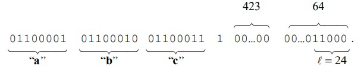
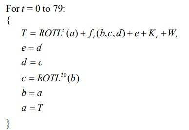
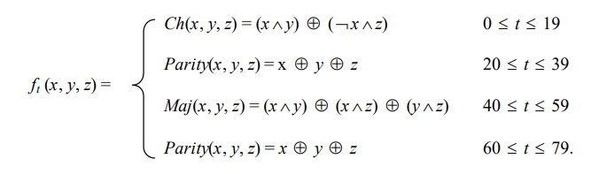
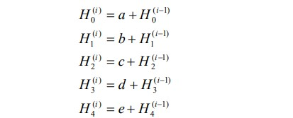

# SHA1

## 简介

任何0~2^64次方bit的输入，都可以转换为一个160bit的信息摘要

## 如何补位

给输入分组，512bit为一组，然后会有不足512bit的部分。我们假设这不足512bit的部分是：`01100001 01100010 01100011`，然后进行补位：

1. 第一位补1，死规则，别问为什么，这是SHA1设计者规定的
2. 后面的64位用于表示消息的长度
3. 中间位置全部补0
4. 用公式表示：L mod 512 = 448
5. 
6. 但是我们可能会遇到特殊情况
   - 如果位置不够65位（1+64）来补充呢？比如剩余510bit，只有2bit位置提供我们补充。那么我们只能再往后512bit来进行补充
   - 

## 每个512bit块运算

### 预处理

- 0~15块照抄
- 16~79块进行运算（ROTL1是左移1位，同理ROTLn就是左移n位）

比如：W16 = (W13 ^ W8 ^ W2 ^ W0) << 1

并且每一个块中的数用十六进制表示。如例子"abc"转换出的W0=61626380，一共32个bit，8个十六进制位

这是官方规定的初始链接变量。

注意：后面的每一个512bit块会有一个160bit的输出，这160bit的输出会被分成五份，然后通过运算成为新的链接变量

### 80轮运算

1. a，b，c，d，e分别被链接变量赋值
2. T是一个临时变量（计算得到），e被d赋值，d被c赋值，c被b循环左移30位的值赋值，b被a赋值，a被T赋值
3. T的计算：a循环左移5位，f函数计算，e的值，Kt的值，Wt的值
   - f函数计算
     - 
   - Kt的值
     - 

经过这个80轮的运算，我们得到了最终的a，b，c，d，e

如果还有下一个512bit块，那么我们需要继续进行计算。首先更新下一个512bit的链接变量：

> 注意：我们这里的加法是模运算（Addition modulo 2^w)，我们这里是2^32

然后用同样的方法计算出a，b，c，d，e。

最终得到的a，b，c，d，e，五个H拼接成的160bit就是最终的输出